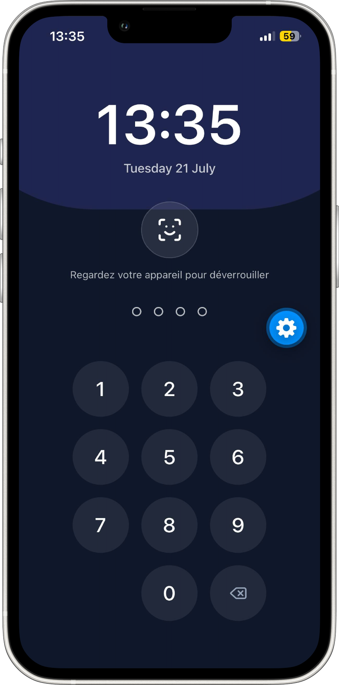
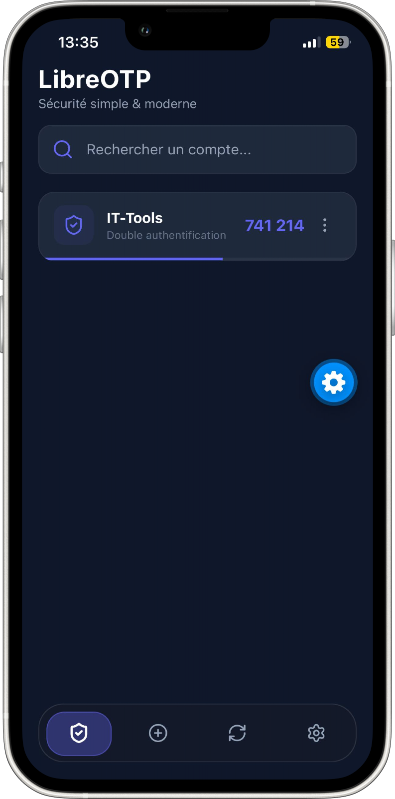

# LibreOtp


Open Source Encrypted Authenticator App offering a robust, secure, and
transparent solution for two-factor authentication (2FA). Designed to
enhance security, privacy, and user autonomy, this app is ideal for
individuals and organizations seeking a trustworthy way to manage
multi-factor authentication codes.

**This release is a full redesign of LibreOtp** — a new interface, and a
batch of new features: app lock (PIN + Face ID / fingerprint), encrypted
cloud sync on your own server, local encrypted backups, and a language
selector with automatic detection of your phone's language.

## Features

-  **Add accounts** by scanning a QR code or entering the secret manually
- **Live codes** with previous / current / next view, so a clock drift
  never locks you out
-  **App lock** with a 4-digit PIN and optional Face ID / fingerprint
-  **Local encrypted backup** — export/import an encrypted file protected
  by a password of your choice
-  **Cloud sync** on your own self-hosted PocketBase server — encrypted
  end-to-end, your password never leaves your device
-  **Multi-language** — automatically follows your phone's language, or
  pick one manually in Settings. Adding a new language takes one JSON file,
  no coding needed (see [CONTRIBUTING_TRANSLATIONS.md](./CONTRIBUTING_TRANSLATIONS.md))
-    **100% open source**, no ads, no trackers, no data collection

## Downloads

[](https://github.com/YidirK/LibreOtp/releases/latest)

*(Grab the `.apk` from the [latest release](https://github.com/YidirK/LibreOtp/releases/latest) assets.)*

## Screenshot




## Self-hosting (cloud sync)

Cloud sync is entirely optional. If you'd rather not depend on a
third-party server for your 2FA backup, you can run your own
[PocketBase](https://pocketbase.io) instance — it's a single lightweight
binary, free and open source.

### Why this is a good fit for businesses

Self-hosting isn't just for individual privacy — it also makes LibreOtp a
solid alternative to commercial authenticator apps (Google Authenticator,
Authy, etc.) for companies and teams:

- **Full data ownership** — your employees' 2FA vaults never touch a
  third-party server; everything stays on infrastructure you control
  (on-prem, your own VPS, or your existing cloud account)
- **No per-seat licensing** — PocketBase and LibreOtp are both free and
  open source, so there's no subscription cost to scale to more employees
- **Centralized account management** — since accounts live in your own
  PocketBase instance, IT can manage, audit, or revoke access the same way
  as any other internal service you already run
- **Compliance-friendly** — useful for organizations that need 2FA secrets
  to stay within a specific country, region, or private network for
  regulatory reasons
- **Still end-to-end encrypted** — even self-hosted, the encryption
  passphrase never leaves the employee's device, so your own IT team never
  has access to the plaintext codes either

For a company deployment, a single small PocketBase instance can comfortably
serve an entire team, since each vault is just one small encrypted blob per
user.

### 1. Deploy PocketBase

Download and run PocketBase on any server, VPS, NAS, or Docker container
you control. Follow the official [PocketBase docs](https://pocketbase.io/docs)
to get it running and reachable over HTTPS (a valid certificate is required —
most mobile OSes block plain HTTP requests to remote hosts).

### 2. Create the `otp_vaults` collection

The app expects one collection in addition to PocketBase's built-in `users`
collection (which already exists by default and handles email/password
accounts — nothing to configure there).

**Easiest way — import the ready-made schema:**

1. Open your PocketBase Admin UI → **Settings → Import collections**
2. Upload the [`pb_schema.json`](./pb_schema.json) file from this repo
3. Review the diff and confirm the import

This creates the `otp_vaults` collection with the correct fields and access
rules already set up (each user can only read/write their own vault).

**If the import fails** (schema format can change between PocketBase
versions), create it manually instead:

| Field            | Type     | Required | Notes                                              |
|------------------|----------|----------|-----------------------------------------------------|
| `owner`          | relation | ✅        | Relation to `users`, single select, cascade delete   |
| `encrypted_blob` | text     | ✅        | Stores the client-side encrypted backup             |

And set these API rules on the collection so users can only access their
own vault:

```
List/View/Create/Update/Delete rule: @request.auth.id = owner
```

### 3. Point the app to your server

In the app: **Settings → Sécurité & Données → Auto-hébergement**, enter your
PocketBase URL (e.g. `https://otp.mydomain.com`) and save — the app will
check the connection right away.

### 4. Create an account and sync

Go to the **Synchronisation** tab, create an account (this hits *your*
server, not ours), then use **Save** / **Restore** with an encryption
passphrase of your choice. That passphrase never leaves your device —
your server only ever stores an encrypted blob it cannot read.

## Contributing

- **Translations**: see [CONTRIBUTING_TRANSLATIONS.md](./CONTRIBUTING_TRANSLATIONS.md)
  — no coding
  required, just a JSON file.
- **Bugs & ideas**: open an issue on this repo.

## Credits

- [Logo & Design by Lina Haret](https://www.pinterest.com/haretlina/)
- [Author: Yidir Kahlouche](https://hergol.me/)